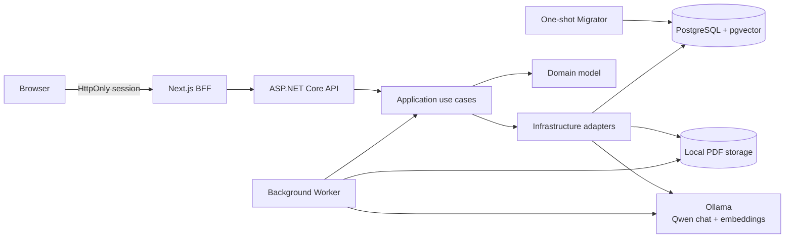
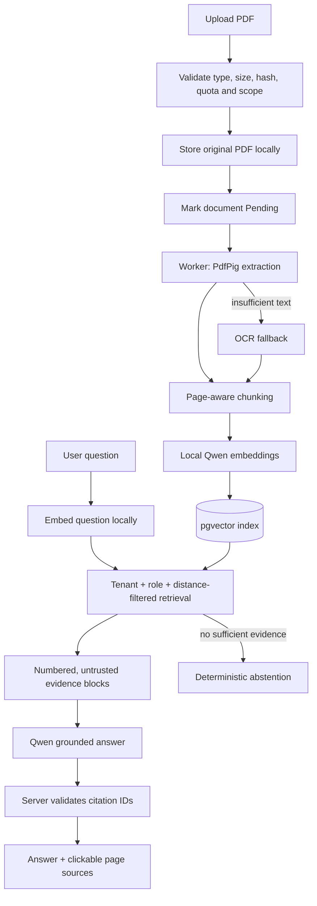

# ServicePilot

> A production-shaped, multi-tenant field-service platform and a hands-on study
> of secure, local-first Retrieval-Augmented Generation (RAG).

[](https://github.com/Bekican/servicepilot/actions/workflows/quality.yml)
[](https://github.com/Bekican/servicepilot/actions/workflows/security.yml)


ServicePilot helps small and medium-sized technical-service companies manage
customers, services, appointments, technicians and reminders. Its knowledge
assistant turns tenant-owned PDF procedures and service reports into grounded,
page-level answers without sending document content outside the machine.

This is a portfolio and learning project, not a currently hosted commercial
service. The repository deliberately goes beyond a happy-path demo: it records
architectural decisions, models operational failure, enforces tenant boundaries
in the database query, and keeps a repeatable full-stack acceptance gate.

## Why I built it

I wanted to learn how an LLM feature fits into a real product rather than build
an isolated chatbot. ServicePilot gave that feature realistic constraints:
authentication, roles, tenant isolation, background work, document lifecycle,
failure recovery, accessible UI and measurable answer quality.

The result is both a field-service SaaS foundation and my first deep,
end-to-end implementation of a local RAG system.

## What is implemented

### Field-service platform

- Organization onboarding and tenant-scoped authentication
- Owner, Admin, Technician and Viewer capabilities
- User invitations, account lifecycle and immutable audit events
- Customer, address and service-catalog management
- Time-zone-aware appointments with overlap protection
- Durable reminders with retry, failure visibility and manual recovery
- Responsive, accessible Next.js dashboard and operational workflows
- Correlated Problem Details, health checks and OpenTelemetry foundations
- One-shot database migrator, immutable images, backup and rollback runbooks

### Local knowledge assistant

- PDF upload, validation, content hashing, quotas and lifecycle states
- Shared, Operations and Management document access scopes
- Background PDF extraction with OCR fallback for scanned documents
- Page-aware chunking and local `qwen3-embedding:0.6b` embeddings
- Tenant- and role-filtered cosine retrieval with PostgreSQL + pgvector
- Grounded generation with local `qwen3:4b`
- Clickable citations that open the original PDF at the referenced page
- Server-validated citation allowlists and deterministic abstention
- No cloud fallback: document text and questions remain on the local machine

## Architecture

ServicePilot is a modular monolith with separate API, Worker, Web and Migrator
processes. Business rules stay framework-independent, while PostgreSQL is the
source of truth for both operational data and vector retrieval.



The dependency direction is intentional:

```text
Api / Worker / Migrator -> Application -> Domain
                       \-> Infrastructure -> Application + Domain
Web                    -> API through a thin server-side BFF
```

The decisions behind the architecture are documented as 26 ADRs in
[`docs/architecture/decisions`](docs/architecture/decisions), including the
[local AI knowledge-assistant decision](docs/architecture/decisions/0026-add-tenant-isolated-local-ai-knowledge-assistant.md).

## RAG pipeline



### Trust boundaries that matter

- Tenant and role isolation happen in the retrieval query, not in the prompt.
- Uploaded text is treated as untrusted evidence, including prompt-like content.
- The model may cite only evidence identifiers issued by the server.
- Unsupported or malformed citations are rejected after generation.
- Low-confidence retrieval produces a controlled “not found in the documents”
  response instead of an invented answer.
- Ollama endpoints are restricted to local addresses; there is no silent cloud
  fallback.

## What I learned

This project changed how I think about LLM application engineering:

1. **RAG is a system, not a prompt.** Extraction quality, chunk boundaries,
   metadata, authorization, retrieval thresholds and evaluation matter as much
   as model selection.
2. **Abstention is a product feature.** A trustworthy assistant must know when
   its evidence is insufficient and make that state understandable to users.
3. **Security belongs before generation.** Tenant and role filtering must be
   enforced before any chunk enters model context.
4. **Citations need a contract.** Source IDs must be server-owned, validated and
   mapped back to a stable document/page URL.
5. **Background processing needs explicit states.** Pending, Processing, Ready
   and Failed make ingestion observable and retryable instead of mysterious.
6. **Database constraints complete application rules.** Concurrency, uniqueness,
   appointment overlap and one-time tokens cannot rely only on pre-checks.
7. **Quality must be measurable.** Retrieval recall, groundedness and abstention
   are repeatable gates, not impressions from a few chatbot conversations.
8. **Operational design is part of software design.** Health checks, migrations,
   backups, rollback, structured errors and correlated telemetry influence the
   architecture from the beginning.

## Selected engineering decisions

| Decision                  | Reasoning                                                                                                            |
| ------------------------- | -------------------------------------------------------------------------------------------------------------------- |
| Modular monolith          | Keeps deployment and transactions simple while preserving explicit capability boundaries.                            |
| PostgreSQL + pgvector     | Places tenant metadata, authorization filters and vector retrieval in one transactional data platform.               |
| Exact cosine search first | Correctness and explainability are more valuable than premature approximate-index complexity at the current scale.   |
| Local Ollama models       | Preserves document privacy and keeps the provider behind application interfaces for a future controlled replacement. |
| Next.js BFF               | Keeps access tokens out of browser JavaScript and centralizes session-aware API calls.                               |
| Separate Worker           | Makes document ingestion and reminders durable, retryable and independent of request latency.                        |
| Server-owned abstention   | Prevents model behavior from being the only defense against unsupported answers.                                     |
| ADRs and runbooks         | Captures why the system looks this way and how high-risk operations are verified.                                    |

## Quality evidence

The complete acceptance gate currently covers:

- 92 domain/application unit tests
- 16 architecture-boundary tests
- 63 PostgreSQL/Testcontainers integration tests
- 31 frontend unit and component tests
- 4 Playwright desktop/mobile end-to-end journeys
- EF Core migration-drift detection
- .NET and npm dependency audits
- staging configuration, container and recovery validations

The local Qwen evaluation suite has verified the included corpus at:

| Metric             | Result |
| ------------------ | -----: |
| Retrieval Recall@3 |   100% |
| Grounded answers   |   100% |
| Correct abstention |   100% |

These figures describe the checked-in evaluation cases and local model version;
they are a regression baseline, not a claim of universal model accuracy.

Run the same gate used by CI:

```powershell
./scripts/verify-mvp.ps1
```

Run the real local-model evaluation separately:

```powershell
dotnet run --project experiments/ServicePilot.AiLab -- eval
```

## Technology

| Area       | Stack                                                                |
| ---------- | -------------------------------------------------------------------- |
| Backend    | .NET 10, ASP.NET Core, EF Core                                       |
| Frontend   | Next.js 16, React 19, TypeScript, Tailwind CSS, shadcn/ui            |
| Data       | PostgreSQL 17, pgvector                                              |
| Local AI   | Ollama, `qwen3:4b`, `qwen3-embedding:0.6b`                           |
| Documents  | PdfPig, OCR fallback, local file storage                             |
| Testing    | xUnit, Testcontainers, Vitest, Testing Library, Playwright, axe-core |
| Operations | Docker Compose, Caddy, OpenTelemetry, Restic, GitHub Actions         |

## Run locally

### Prerequisites

- Docker Desktop
- PowerShell 7+
- .NET 10 SDK
- Node.js 24 (only needed for running frontend commands outside Docker)
- Ollama for real RAG answers

Pull the local models:

```powershell
ollama pull qwen3:4b
ollama pull qwen3-embedding:0.6b
```

Start the stack, apply migrations and seed the idempotent demo tenant:

```powershell
./scripts/start-demo.ps1
```

Open:

| Service          | URL                                     |
| ---------------- | --------------------------------------- |
| Web application  | <http://localhost:3000>                 |
| OpenAPI document | <http://localhost:5267/openapi/v1.json> |
| Mailpit          | <http://localhost:8025>                 |

Local-only demo credentials:

```text
Organization: servicepilot-demo
Email: owner@servicepilot.local
Password: Demo1234!
```

> These values are disposable fixtures, not production credentials. Never
> reuse them outside the local demo.

After login, open **Bilgi Asistanı**, upload a technical PDF, wait until its
state becomes **Hazır**, then ask a question answered by that document. Every
grounded response exposes clickable page sources; unrelated questions should
produce an explicit abstention.

## Repository map

```text
apps/web/                         Next.js BFF and user interface
src/ServicePilot.Domain/         Entities, value rules and domain behavior
src/ServicePilot.Application/    Use cases, policies and ports
src/ServicePilot.Infrastructure/ EF Core, pgvector, PDF, OCR, Ollama, SMTP
src/ServicePilot.Api/            HTTP API, auth, rate limits and health checks
src/ServicePilot.Worker/         Reminder and document-ingestion workers
src/ServicePilot.Migrator/       One-shot schema migration process
tests/                            Unit, architecture and integration suites
experiments/ServicePilot.AiLab/  Local model contracts and RAG evaluation
docs/architecture/decisions/     Architecture Decision Records
docs/operations/                 Release, recovery and observability runbooks
deploy/staging/                  Production-shaped deployment templates
```

## Security and privacy

- The repository contains only example/local configuration values.
- `.env`, private keys, certificates, local document storage and deployment
  state are ignored by Git.
- The full Git history is scanned for secrets before public release, and CI
  repeats secret, dependency and CodeQL analysis.
- Vulnerabilities should be reported privately according to
  [`SECURITY.md`](SECURITY.md), never through a public issue.
- Real deployments must provide unique secrets, external SMTP, encrypted
  off-site backups and hosted observability as described by the production
  validation scripts.

## Current scope and trade-offs

- This repository is not currently deployed or offered as a hosted service.
- Local Ollama quality and latency depend on available CPU/GPU and model build.
- Exact vector retrieval intentionally favors correctness over large-corpus
  scale; approximate indexing is deferred until measurements justify it.
- Inventory, payments, advanced reporting and multi-region infrastructure are
  outside the current scope.
- Production use would still require environment-specific capacity, security,
  legal/privacy and disaster-recovery review.

## Documentation

- [Architecture decisions](docs/architecture/decisions)
- [Production release checklist](docs/operations/production-release-checklist.md)
- [PostgreSQL recovery and rollback](docs/operations/postgresql-recovery-and-release-rollback.md)
- [Authentication and tenant context](docs/engineering-notes/authentication-and-tenant-context.md)
- [Correlated errors and logging](docs/engineering-notes/correlated-problem-details-and-logging.md)
- [AI Lab](experiments/ServicePilot.AiLab/README.md)

## Contributing

This is primarily a learning and portfolio project, but focused issues and
pull requests are welcome. Read [`CONTRIBUTING.md`](CONTRIBUTING.md) before
opening a change.

Built by [Bekir Can](https://github.com/Bekican) as a deliberate exercise in
multi-tenant SaaS engineering, operational reliability and trustworthy local
RAG.
